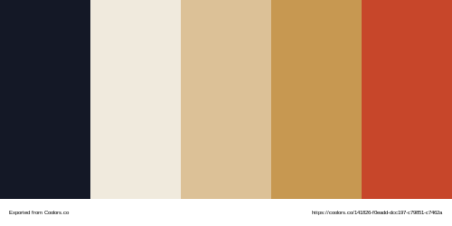

# Graphical Charter

## Colors

[Link to Coolors pallet](https://coolors.co/232a43-498cff-f1f1e6-f0eadd-f9c741)

- Dark Blue : `#232a43`
- Blue : `#498cff`
- White : `#f1f1e6`
- Beige : `#f0eadd`
- Yellow : `#f9c741`



## Font family

[Link to Google fonts](https://fonts.google.com/specimen/Ubuntu)

- `Ubuntu`

```html
<link href="https://fonts.googleapis.com/css2?family=Ubuntu:wght@300;400;500;700&display=swap" rel="stylesheet">
```

## Icons

[Link to Google Icons](https://fonts.google.com/icons)

## Logo


